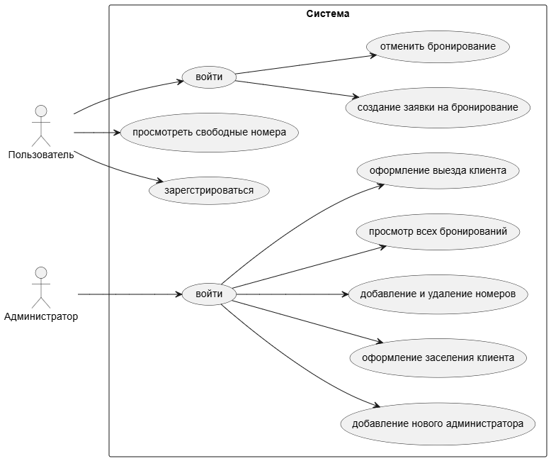

Постановка задачи и определение требований к информационной системе «Учет гостиничных номеров»

1. Описание предметной области
Учет номерного фонда и регистрация бронирований в гостинице.
В системе учитываются :
  Номер:содержит параметры (номер комнаты, стоимость за сутки, статус бронирования).
  Клиент:содержит основные данные (фамилия, имя).
  Бронирование:содержит параметры записи (идентификатор клиента, номер комнаты, дата заезда, дата выезда).

2. Цели создания системы
  Учет номерного фонда:ведение базы данных номеров и их характеристик.
  Исключение двойного бронирования:предотвращение назначения одного номера разным клиентам на одни и те же даты.
  Отображение статуса номеров:фиксация состояния номера (свободен, забронирован, занят).
  Расчет стоимости:автоматическое вычисление итоговой суммы проживания по количеству дней.

3. Пользователи системы и их роли
В системе выделены две роли пользователей:
 Клиент
  Права и возможности:
  - Просмотр списка номеров.
  - Регистрация в системе.
  - Вход в систему.
  - Поиск свободных номеров на выбранные даты.
  - Создание заявки на бронирование.
 Администратор
  Права и возможности:
  - Вход в систему.
  - Добавление новых администраторов.
  - Добавление и удаление номеров.
  - Просмотр всех бронирований.
  - Регистрация заселения и выселения клиентов.
  - Изменение статуса номера.

4. Перечень функций системы
Система выполняет следующий набор функций:
  Управление номерами:
  - Добавление нового номера в базу данных.
  - Изменение статуса номера (свободен/занят).
  Управление бронированием:
  - Проверка занятости номера на указанные даты.
  - Создание записи бронирования.
  - Расчет стоимости проживания (умножение количества дней на цену за сутки).
  Управление проживанием:
  - Изменение статуса номера при заезде и выезде клиента.
  Поиск:
  - Поиск свободных номеров на заданный период.
  Управление пользователями:
  - Регистрация нового клиента.
  - Вход в систему
  - Назначение прав и регистрация нового администратора(выполняется администратором)